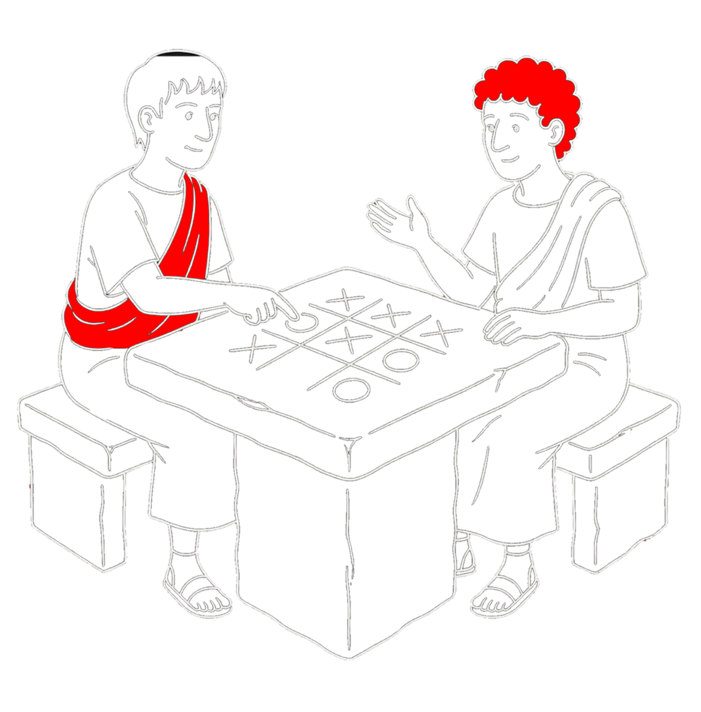

<div align="center">
  
</div>

# 3T Project Documentation


## Table of content
- [Game State](#game-state)
    - [State Representation](#state-representation)
        - [Approaches](#approaches)
        - [Final Representation](#bit-layout-left--right)
- [Game Graph/Map](#game-graph)
    - [Graph/Map Representation]()
    - [Next States Generation]()
        - [Symmetry Reduction]()
            - [Rotation Symmetry]()
            - [Reflection Symmetry]()
            - [Cannonical Collapse]()
    - [Setting Scores]()
    - [MaxiMax: Self-proclaimed MiniMax varient]()
- [Game Engine]()


## Game State
A **Game State** represents a complete snapshot of the Tic-Tac-Toe board at a specific moment in time.

Each state is:
- Immutable
- Self-contained
- Uniquely identifiable

A state fully defines:
- Board configuration

This design enables deterministic graph traversal, serialization.


### State Representation
For the state representation, we require to only represent the occupied position of X and O in the 9 cells 
of Tic-Tac-Toe game board.

At any given point in time, a cell can be either:
- occupied by x
- occupied by O
- vacant


### Approaches
- [Array of length 9](#approach-1-array-of-length-9)
- [Integer with 9 digits](#approach-2-9-digits-integer)
- [32 bit unsigned integer](#approach-3-32-bit-unsigned-integer)


### Approach 1: Array of length 9
If we represent a cell:
- occupied by x with 1
- occupied by O with 2
- vacant with 0

and use an array of length 9, it will occupy size $= 9*sizeOf(each\_element) = 9*8 = 72\ bytes = 576\ bits$
>\* since the smallest int type in golang requires size 8 bytes

### Approach 2: 9 digits Integer
If we represent a cell:
- occupied by x with 1
- occupied by O with 2
- vacant with 0

and use an integer of 9 digits, it will occupy size $= log_2(10^{9+1})\ bits = 33.22\ bits \approx 34\ bits$

>\* In golang it will need 64 bits at least


### Approach 3: 32-bit unsigned integer
I tried a lot of ways to represent the game state that would require minimum resource, and came up 
with a representation that requires only 18 bits:
- 9 bits to represent cells occupied by X
- 9 bits to represent cells occupied by O

This requires 18 bits and in go will need 32 bits with uint32 or int32 type

Noticing that we still have 14 bits free in out 32 bits variable (if used uint32), to reduce the computation
for:
- vacancy cells (we can store 9 bits for in the number itself) 
- Whether the game has ended or not? (we can store 1 bit for this) 
- - If ended then is it a tie or not? (we can store 1 bit for this)
- - - If not tie then who won? (we can store 1 bit for this)
- - - If not tie then who lost? (we can store 1 bit for this)
- If not ended then who will play next turn? (we can store 1 bit for this)

So, we utilize the 32 bit resource completely.

### Final State representation
### Bit Layout (Left → Right)

### Field Description

<div align="center">

| Field | Bits | Meaning                                           |
|------|------|---------------------------------------------------|
| `C` | 1 | Continuum flag (not a terminal state)             |
| `T` | 1 | Tie state  (is the state a tie terminal state)    |
| `W` | 1 | Win state  (who won this state : (0 = X, 1 = O))  |
| `L` | 1 | Loss state (who lost this state : (0 = X, 1 = O)) |
| `Turn` | 1 | Next player (0 = X, 1 = O)                        |
| `X` | 9 | Bitmask of X positions (0 = absent, 1 = present)  |
| `O` | 9 | Bitmask of O positions (0 = absent, 1 = present)                          |
| `Vacancy` | 9 | Empty board positions (0 = absent, 1 = present) |

</div>

- Each board cell is represented by a single bit.
- For any cell, exactly one of `X`, `O`, or `Vacancy` is set.
- No redundant information is stored.

>The entire game state is encoded into a single **32-bit unsigned integer (`uint32`)** called `State`.

```go
type State uint32
```
>declared [here](../src/model/structure.go#L7)
## Game Graph

The game graph is a key value pair map with key of type State (uint32) 
and the value of type struct StateProps (short for State Properties)

```go
type StateProps struct {
	Score      float32
	WinDepth   int8
	LoseDepth  int8
	NextStates []State
}

type GMap map[State]StateProps

```
>declared [here](../src/model/map.go#L11-18)